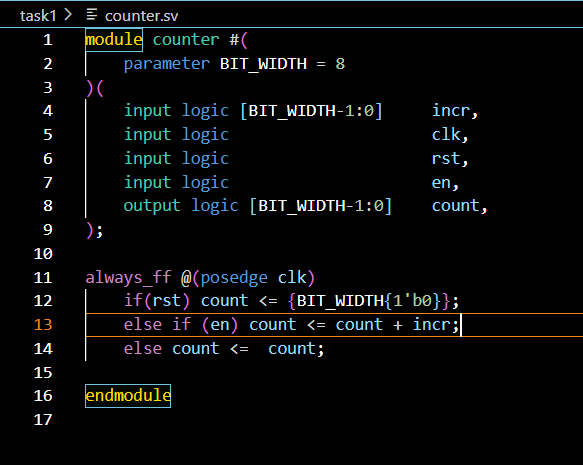
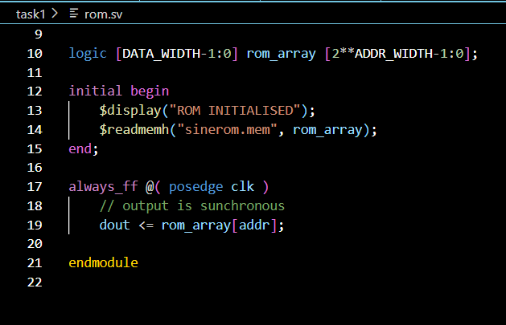
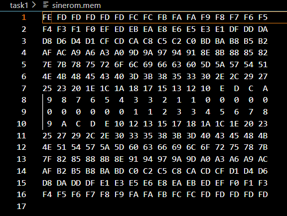
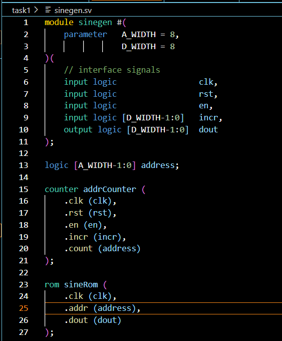
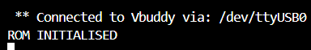
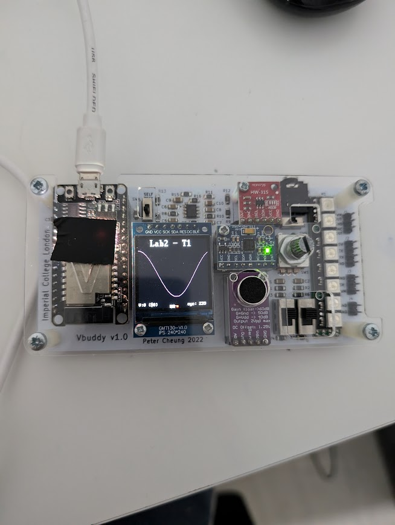

**SV File**

- There are three files in this task, two behavioural and one structural
- The counter counts up and the output from this is then fed as the address input to the rom
- The rom then outputs the relevant data from that rom (in this task that is the samples of a sinewave)

- The counter file remains the same and counts up

- The rom file 
- It is instantiated with this .mem file which contains the samples in the correct address structure and bit width of the rom

- This is the top level behavioural file which instantiates the two structural files in there with the parameters
- This file has an intermediate wire that connects the output of the counter to the address input of the rom

**Vbuddy**

