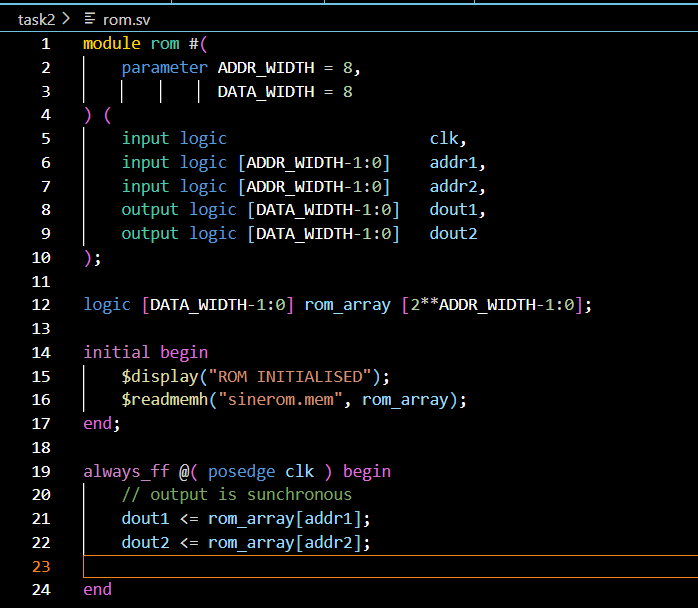
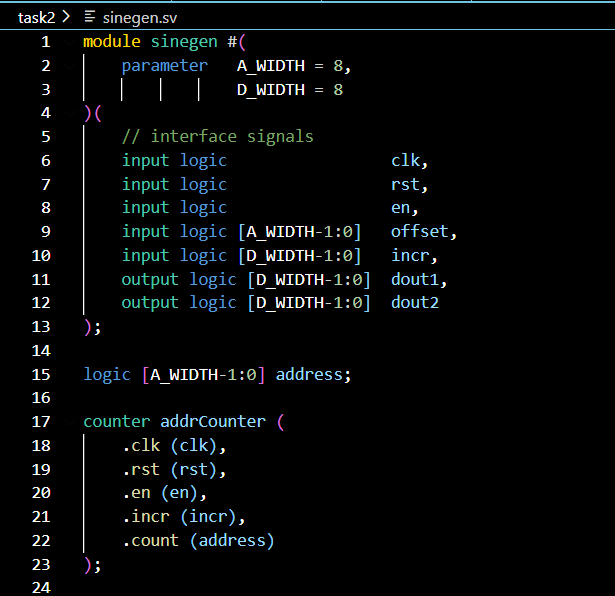
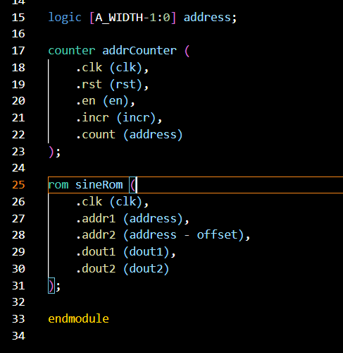
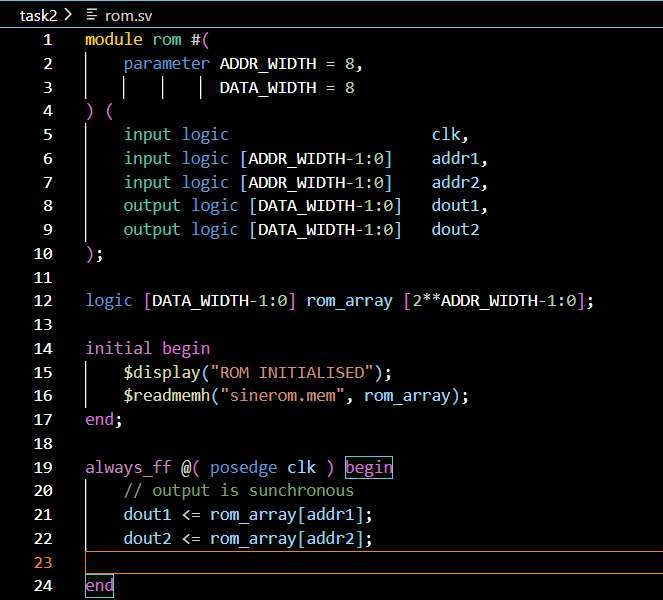
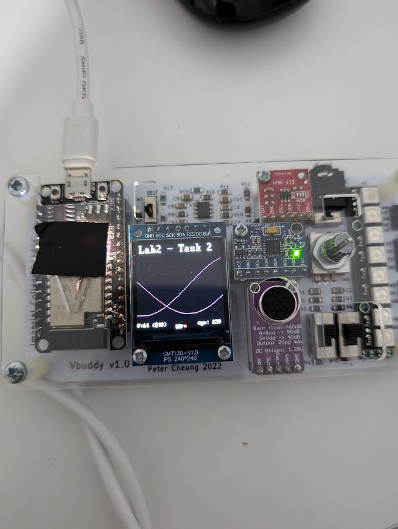
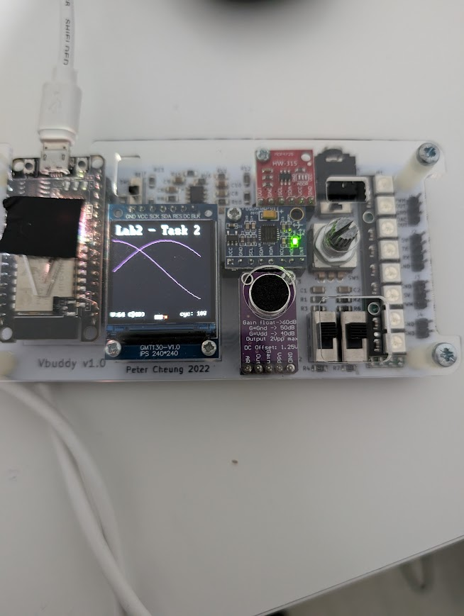

**SV File**

- Updated the rom file to have two output ports so that one cos channel can output and one sine channel can output

- The top level file had an extra input for the offest, which is set using the dial and the offset (same bit width as addresses) is added to the address output from the counter
- This is then the offset between the two sinusoids and this is updated in real time during the vbuddy simulation

- The offset is subtracted so that the second wave is behind the wave ahead

- The rom sv file is updated to have two output ports and thus two address ports
- These work together and output the data at addr1 and addr2 respectively on positive edges of clock cycles

- The counter file remains the same because the offset calculation happens in the top level file and there is no need to add an extra output here to accomodate for another address/output port

**Vbuddy**

- One cos and one sine wave

