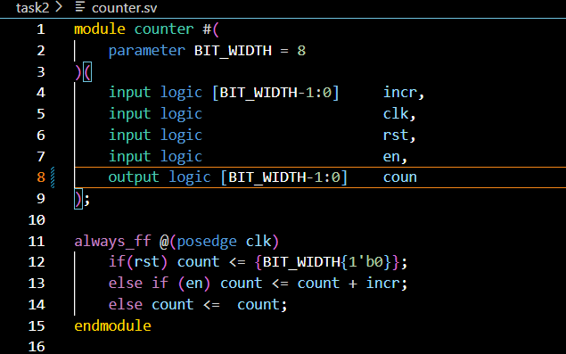
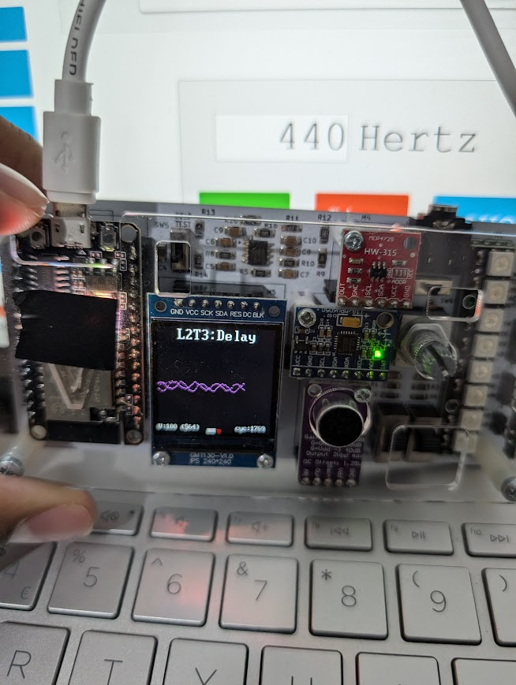
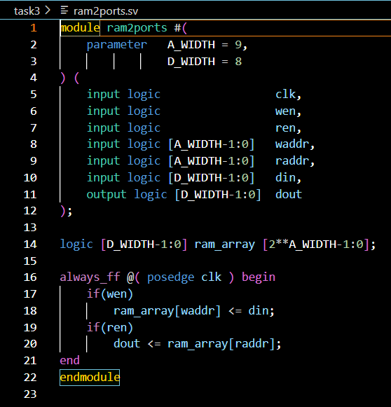
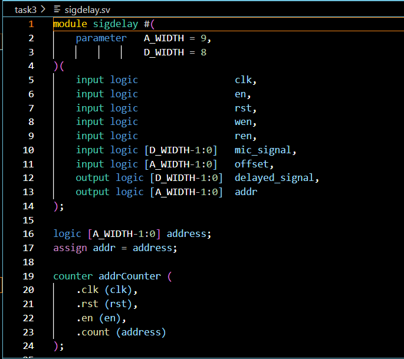
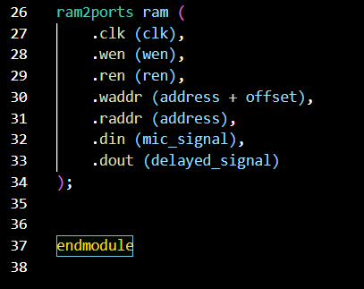

**Vbuddy**

- two signals with f = 440 Hz in the background with adjusted offset delays using the dial
- delay one was 33 and delay two was 100

**SV Files**

- A ram is needed to both read the current mic values into the storage/fli flops and then a read pointer follows suit an adjustable offset behind this writing pointer
- It can be behind or infront of the writing pointer but there may be some latency and the adjustability will change direction as well
- We use a 512 x 8 bit ram

- The top level file looks like this where the
- There is a debugging output also seen in the pictures to figure out what the issue was
- The issue was that my counter.sv file was not increasing the count by 1 on posedge clk it was just setting it to be 1

